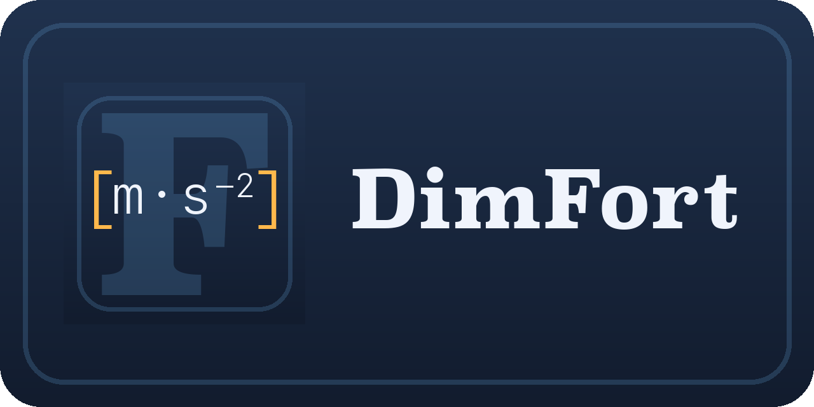

# DimFort



[](https://github.com/ArrialVictor/DimFort/actions/workflows/release.yml)
[](LICENSE)
[](pyproject.toml)

Static unit-consistency checker for Fortran. You annotate declarations with the
dimension they should carry, and DimFort verifies that assignments, arithmetic,
intrinsics, and procedure calls all line up. Annotations are written as a
custom Doxygen command, so a single source of truth feeds both the checker and
your generated documentation.

```fortran
real :: velocity  !< @unit{m/s}
real :: mass      !< @unit{kg}
real :: force     !< @unit{kg*m/s^2}

force = mass * velocity            ! diagnosed: force unit is kg, expected kg*m/s^2
```

> Status: **pre-alpha**. End-to-end, these work today: the annotation
> scanner, attachment pass, the full H-series checker (H001–H004),
> intrinsics, user-defined function and subroutine calls, derived-type
> field access, rational `**` exponents, multi-file worksets, a
> workspace-aware LSP server with live-edit diagnostics, hover, inlay
> hints, go-to-definition, code lens, code actions, completion, and a
> CLI that accepts files or directories.

## Install

```bash
git clone https://github.com/ArrialVictor/DimFort.git
cd DimFort
pip install -e ".[dev,lsp]"
```

Requires Python ≥ 3.11. The Fortran parser
([tree-sitter-fortran](https://pypi.org/project/tree-sitter-fortran/))
is installed automatically as a runtime dependency — no external
compiler or subprocess required for parsing. For `.F90` files using
CPP `#`-directives DimFort shells out to the system `cpp` if
`[parser] cpp_defines` or `[parser] include_paths` are set in
`.dimfort.toml`.

## Usage

```bash
dimfort check path/to/file.f90       # check a single file
dimfort check path/to/project/       # walk a directory recursively
dimfort check path/...  --summary    # also print a per-file H/U count table
dimfort lsp                          # start the language server (stdio)
```

Exit code is `0` if no errors, `1` if any error-severity diagnostic was
produced, `2` for usage / file / config errors. Warnings alone do not
fail the run.

Diagnostic codes split into two families:

- **H-series** (`H001`–`H004`) — homogeneity violations: the math
  doesn't balance dimensionally. Real bugs.
- **U-series** (`U001`, `U002`, `U005`–`U007`, `U010`, `U-conflict`) —
  annotation / metadata problems: something's wrong with the
  annotations themselves, not the math.

Full reference: [docs/usage.md](docs/usage.md).

## Doxygen integration

Annotations are read from Doxygen comments (`!>` / `!!` preceding a
declaration, or `!<` trailing it) and apply to every variable in a
declaration list. To make Doxygen render them natively, add one line to
your `Doxyfile`:

```
ALIASES += "unit{1}=\par Unit:^^\1"
```

Module-level constants follow the same notation:

```fortran
!> @brief Gravitational acceleration.
!> @unit{m/s^2}
real, parameter :: g = 9.81
```

See [docs/annotations.md](docs/annotations.md) for the full reference:
unit-expression grammar, continuation-line forms, declaration lists,
and the diagnostic codes the scanner can emit.

## Documentation

- [Annotations](docs/annotations.md)
- [Usage details](docs/usage.md)
- [Language server](docs/lsp.md)
- [Releases](docs/release.md)

## Editor integrations

Thin LSP clients that wire `dimfort lsp` into common editors. Each
lives in its own repository, releases on its own cadence, and shares
the same feature surface (diagnostics, hover, inlay hints,
go-to-definition, code actions, completion).

- [DimFort-VSCompanion](https://github.com/ArrialVictor/DimFort-VSCompanion) — VSCode extension.
- [DimFort-NvimCompanion](https://github.com/ArrialVictor/DimFort-NvimCompanion) — Neovim plugin (Neovim ≥ 0.11).
- [DimFort-EmacsCompanion](https://github.com/ArrialVictor/DimFort-EmacsCompanion) — Emacs package (eglot + lsp-mode).

## License

See [LICENSE](LICENSE).
