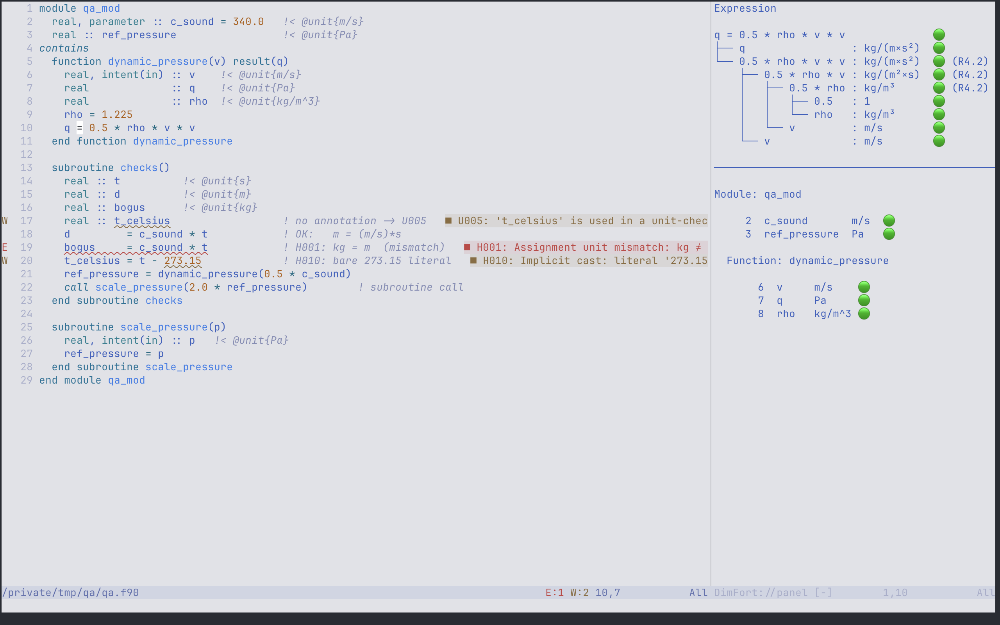
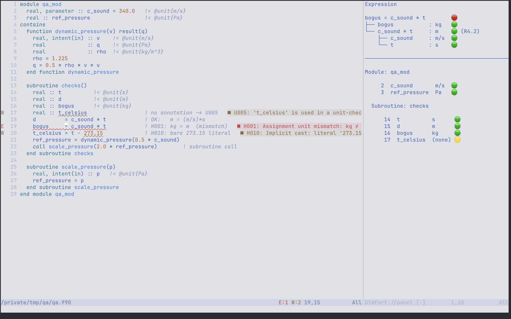

# Side-panel info endpoint — design notes

Status: **draft / no implementation yet**. Doc-first per the
algebra-extension precedent. Branches:
- `DimFort`            → `panel-info-endpoint`
- `DimFort-NvimCompanion` → `split-view-prototype`

This document is a working spec to settle the data model and the
panel layout before any code lands. The features that survive a
two-session usage trial in Neovim graduate to Emacs and VSCode; the
ones that don't, get cut.


## Motivation

The Detailed-hover layout already renders a full unit-algebra tree
for the expression under the cursor, but it dismisses the moment the
cursor moves. Two workflows want a *persistent* view:

1. **Code archaeology** — opening an annotated codebase you didn't
   write (LMDZ-class) and surveying which variables carry which
   units. A flat per-routine table is much faster than `K`-hovering
   every declaration.
2. **Pair / talk-through** — two people on one screen reading
   annotations together. A side panel makes the unit-of-everything
   visible without choreographing key presses.

Both want **"open it to explore, close it when editing"** rather than
always-on. Default off; toggleable; persistent across cursor moves;
debounced cursor-follow updates.


## Scope

In:

- Two stacked sections in a single side panel:
  1. **Expression** — the unit-algebra tree for the expression
     under the cursor (same content as Detailed hover).
  2. **Scope variables** — the declarations of every enclosing scope
     (subroutine / function / module / program), stacked outermost
     first, each with its unit (or `unannotated` marker). A cursor in
     a module-contained subroutine shows the module's declarations
     *and* the subroutine's locals as separate sections.
- Nvim-first prototype. Emacs port second. VSCode last.
- Settings to toggle visibility and layout (both / expression-only
  / routine-only).

Out (for v1, revisit later):

- Cross-file workspace-wide views (e.g. all modules' constants).
- Editing from the panel (e.g. click to add `@unit{}`).
- Per-row diagnostics navigation (clicking a row jumps to the line).
- Sort / filter / search controls.

Keep v1 read-only and information-dense. Polish only if usage proves
the panel earns its screen real estate.


## LSP endpoint

A single custom request:

```
request:   "dimfort/panelInfo"
params:    { uri: DocumentUri, position: Position }
response:  PanelInfo | null
```

`null` if the position is outside any analysable region (blank line,
comment-only line, file the server hasn't indexed).

```typescript
interface PanelInfo {
  // The expression's unit-algebra tree, or null if the cursor isn't
  // inside an expression context (e.g. on a declaration line only).
  expression: ExpressionNode | null;

  // The full chain of enclosing scopes, OUTERMOST first
  // (e.g. [module, subroutine] for a cursor inside a module-contained
  // subroutine). Each carries its declarations. Empty when the cursor
  // is at bare file level. The panel stacks one section per entry.
  scopes: ScopeSection[];

  // Innermost scope, surfaced for single-section consumers. Identical
  // to scopes[scopes.length - 1] (or null when scopes is empty). The
  // routine / routineVars fields are further back-compat aliases.
  scope: { name: string;
           kind: "subroutine" | "function" | "module" | "program" } | null;
  scopeVars: ScopeVar[];
  routine: { name: string; kind: string } | null;
  routineVars: ScopeVar[];

  // Diagnostics on the cursor LINE — so the panel can show *why* a node
  // is marked without a hover / Problems trip. Scoped to the line (not
  // the whole file) to stay relevant. Empty array when the line is clean;
  // renderers omit the section entirely in that case.
  diagnostics: PanelDiagnostic[];

  // Symbols brought into the cursor's scope by `use` clauses — usable
  // here but not declared in any enclosing scope, so the scopes[] tables
  // don't cover them. Scoped like Fortran visibility: a module-level
  // `use` shows for any cursor in the module; a routine-level `use` only
  // in that routine. A name declared locally in an enclosing scope
  // shadows the import and is omitted. Empty when nothing is in scope.
  imports: ImportVar[];

  // Whole-file diagnostic counts, for a panel footer / mini-dashboard.
  fileDiagnosticCounts: { error: number; warning: number };
}

interface ImportVar {
  name: string;          // the local name (after any `=>` rename)
  unit: string | null;   // var: the source @unit{}; procedure: its return unit; else null
  unitNormalized: string | null;  // base-SI form when it differs (as ScopeVar)
  module: string;        // the module it was imported from (lower-cased)
  // For a procedure: a function with a return unit (or any subroutine) is
  // "annotated"; a function lacking a return @unit{} is "unannotated".
  kind: "annotated" | "unannotated";
  // True for an imported function/subroutine (renderers append the
  // signature). For a callable, ``signature`` is the parenthesised
  // argument units, e.g. "(kg, m)" or "()" ("?" for an un-annotated arg);
  // absent for a variable.
  callable: boolean;
  signature?: string;
  // Navigation target: the imported variable's DECLARATION in the source
  // module (cross-file), resolved via the workspace module exports + trees.
  // Falls back to the `use` clause's own line in this file when the source
  // declaration can't be located; `file` is then absent (same file).
  file?: string;
  line: number;
  column: number;
}

interface PanelDiagnostic {
  severity: "error" | "warning" | "info" | "hint";
  code: string;     // H001 / S002 / U005 / …
  message: string;
  // 1-based span, so a click can land on (and select) the exact range —
  // not just the line start (the cursor is usually already on the line).
  line: number;
  column: number;
  endLine: number;
  endColumn: number;
}

interface ScopeSection {
  name: string;
  kind: "subroutine" | "function" | "module" | "program";
  vars: ScopeVar[];
}

interface ExpressionNode {
  // Human-readable label (the source slice, lightly normalised).
  label: string;
  // Unit string — always present (never null) since the server
  // resolves all three "no unit" cases to a concrete glyph:
  //   * "-" — structural-no-unit (assignment statement, relational
  //           expression, subroutine call — no unit by design).
  //   * "?" — unknown unit (unannotated identifier, unsupported
  //           intrinsic, partial resolution).
  //   * <formatted> — resolved unit (e.g. "kg·m⁻¹·s⁻²").
  // See design/markers.md §4.5. (Companions that still expect `null`
  // — pre-0.2.1 — will treat the string as a unit and pad accordingly;
  // it's a render-only regression, not a crash.)
  unit: string;
  // Three-tier severity (`ok`/`warn`/`error`) plus a fourth
  // **overlay** value `assumed` (companions render 🔵). `assumed`
  // does NOT participate in worst-of aggregation — it appears only
  // on the RHS row of an assumed assignment as a per-row overlay,
  // and ancestors never inherit it. Severity worst-of stays
  // `error > warn > ok`. See design/markers.md §4.6.
  marker: "ok" | "assumed" | "warn" | "error";
  // The formal unit this node is expected to satisfy, only set when
  // this node is a positional argument of a call whose callee
  // signature is known AND the resolved unit dimensionally differs
  // from the formal. Renderers append `(expected <expected>)` to the
  // row. When a node carries `expected`, the server-side derivation
  // demotes `marker` from `ok` to `warn` (the 🟡-on-`expected`
  // override — see design/markers.md §4.4); a row with
  // `expected: <unit>` therefore never reads `marker: "ok"`.
  expected: string | null;
  // The mandatory reason supplied with
  // `@unit_assume{<unit> : <reason>}`, set on the **RHS row** of an
  // assumed assignment (NOT on the assignment row itself — the
  // directive's syntactic subject is the RHS expression). When set:
  //   * `unit` carries the *asserted* unit (not the computed `?`).
  //   * `marker` reads `"assumed"` (companions render 🔵), unless a
  //     diagnostic owning this node paints 🔴.
  //   * Renderers append `(assumed: <reason>)` to the row tail
  //     (same column as `(expected …)`; both can coexist).
  // The assignment row itself stays clean (`marker: "ok"`) when the
  // homogeneity check passes (LHS unit matches the asserted RHS
  // unit). A declared-unit conflict still fires H001 on the
  // assignment, painting it `"error"` — the assumption never masks
  // a declared-unit conflict. See design/markers.md §4.6.
  assumed: string | null;
  // Sub-expressions whose units feed into this one.
  children: ExpressionNode[];
}

interface ScopeVar {
  name: string;
  // The annotated unit text as written, or null for unannotated
  // declarations. For kind "error" this is the raw (unparseable) text.
  unit: string | null;
  // The base-SI normalized form (factor AND affine offset included), e.g.
  // "hPa" → "100×kg·m⁻¹·s⁻²" (hidden scale factor) and "degC" → "K + 273.15"
  // (affine zero-point), so scale factors, derived-unit expansions, and
  // offsets are all visible. Equals `unit` for base-SI annotations; null
  // when the annotation doesn't parse or is absent. Renderers show
  // `unit = unitNormalized` only when the two differ.
  unitNormalized: string | null;
  // 1-based line number of the declaration.
  line: number;
  // 🟢 annotated (valid unit), 🟡 unannotated (no @unit{}),
  // 🔴 error (has @unit{} but it failed to parse — the U002 set).
  kind: "annotated" | "unannotated" | "error";
}
```

The enclosing scope is the innermost ``subroutine`` / ``function`` /
``module`` / ``program`` node. For routine scopes the declarations are
matched by ``DeclarationSite.scope`` (the routine name); for module /
program scopes, top-level declarations (``scope is None``) are matched
by line span so nested routines' locals are excluded.

**Error-recovery fallback.** A single unparseable statement makes
tree-sitter wrap the whole enclosing routine in an ``ERROR`` node, so the
``subroutine`` / ``function`` node disappears and the scope lookup finds
nothing — the Scope section would blank for that routine even though its
declarations are still recoverable. When the scope lookup yields no node,
the server reconstructs the enclosing scopes line-based
(``recover_scopes``): the routine *header* statement survives inside the
``ERROR``, so each scope's name + kind comes from the surviving headers,
and each scope's extent comes from pairing headers with the closing
``end`` / ``end <kind>`` lines. Declarations are then matched to the
recovered scope that most tightly encloses them (by line span, since the
``ERROR`` collapse strips ``DeclarationSite.scope`` to ``None``), so a
module section still excludes its contained routines' locals and sibling
routines don't bleed into one another. The Expression section is
unaffected — it stays empty inside an unparsed region (see the
``has_error`` guard in ``_find_expression_root``).

The `marker` field on `ExpressionNode` carries the worst-of-children
aggregation already done by the Detailed-hover renderer. Clients
don't need to re-derive it.

Both fields (`expression`, `routineVars`) are optional in the response
— the server returns `null` for whichever doesn't apply. Clients hide
the corresponding section.


## Update cadence

The client triggers `dimfort/panelInfo` on cursor moves, debounced.
Recommended debounce: **200 ms**. Implementations should:

- Cancel an in-flight request if the cursor moves before the response
  arrives.
- Skip the request entirely if the cursor is on a blank line or
  inside a comment (cheap pre-filter to avoid round-tripping for nothing).

The server is stateless w.r.t. this endpoint — it computes from the
last cached `WorksetResult`. No subscription model in v1.


## Panel layout

ASCII mock-up — the panel sits as a vertical split on the right
(Nvim default; configurable).

```
┌─ driver.f90 ────────────────────────┬─ DimFort panel ─────────────┐
│  1  subroutine driver               │ Expression                  │
│  2    use constants_mod, only: ...  │                             │
│  3    use physics_mod,   only: ...  │   bogus = c_sound * t       │
│  4                                  │   ├─ c_sound : m/s       🟢 │
│  5    real :: t          !< @unit{s}│   ├─ t       : s         🟢 │
│  6    real :: d          !< @unit{m}│   ├─ c_sound * t : m     🟢 │
│  7    real :: v          !< @unit{m │   └─ assignment       🔴    │
│  8    real :: bogus      !< @unit{kg│                          H001│
│  9    real :: t_celsius             │                             │
│ 10                                  │ Routine: driver             │
│ 11    t = 2.0                       │  line  name        unit     │
│ 12    d = fall_distance(t)          │     5  t           s        │
│ 13    d = sound_travel(t)           │     6  d           m        │
│ 14    v = c_sound + 5.0             │     7  v           m/s      │
│ 15                                  │     8  bogus       kg       │
│ 16    bogus = c_sound * t           │     9  t_celsius   (none) 🟡│
│ 17    t_celsius = t - 273.15        │                             │
│ 18  end subroutine                  │                             │
└─────────────────────────────────────┴─────────────────────────────┘
```

Highlights:

- Cursor on `bogus = c_sound * t` (line 16) → expression section
  shows the tree with markers; routine section lists every
  declaration in `driver`.
- Cursor on a declaration line → expression section is empty
  (header still visible, body shows "no expression at cursor");
  routine section unchanged.
- Cursor on a blank line / comment → both sections show the
  last cached content (we don't blank the panel on every
  whitespace cursor move).

Sizing:

- Default width: 35% of editor column count, clamped to [40, 80] cols.
- Configurable via setting; user can `:vertical resize N` to override
  in Nvim.

### Rendered example

The real panel (Neovim, the reference renderer) on the `qa.f90` scene
from the companion `MANUAL_QA.md`. Cursor on the `=` in
`q = 0.5 * rho * v * v` — a deep, all-🟢 multiplication tree over the
stacked `Module` / `Function` scope:

<picture>
  <source media="(prefers-color-scheme: dark)" srcset="../img/panel-nvim-hero_dark.png">
  
</picture>

Cursor on the `=` in `bogus = c_sound * t` — a `kg ≠ m` mismatch, the
assignment root marked 🔴:

<picture>
  <source media="(prefers-color-scheme: dark)" srcset="../img/panel-nvim-mismatch_dark.png">
  
</picture>


## Settings (per editor)

| Key (Nvim Lua)            | Type     | Default   | Effect                                |
|---------------------------|----------|-----------|---------------------------------------|
| `panel_enabled`           | boolean  | `false`   | Open the panel on attach              |
| `panel_layout`            | string   | `"both"`  | `"both"` / `"expression"` / `"routine"` |
| `panel_position`          | string   | `"right"` | `"right"` / `"left"` / `"bottom"`     |
| `panel_width_fraction`    | number   | `0.35`    | Fraction of editor width              |
| `panel_debounce_ms`       | number   | `200`     | Cursor-follow debounce                |

Each editor mirrors these under its native config namespace
(`dimfort.panel.*` in VSCode, `dimfort-panel-*` in Emacs).

Commands (Nvim):

- `:DimFortTogglePanel` — open / close.
- `:DimFortPanelLayout {both|expression|routine}` — switch layout.
- `:DimFortPanelRefresh` — force re-request, useful for debugging.


## Implementation plan

Branches stay independent until both are wired:

### Server (`panel-info-endpoint`)

1. Add `dimfort/panelInfo` request handler in `lsp/server.py`.
2. Reuse existing infrastructure:
   - `_trees_for(uri)` to get the parsed tree.
   - `_smallest_enclosing_routine(...)` to find the routine context.
   - The existing trace-collecting code path that builds the
     Detailed-hover tree — refactor to also return a structured form,
     not just the rendered text.
   - `_last_result.attachments[path].var_units` for the routine vars
     list; merge with `_last_scan_declarations(path)` to include
     unannotated declarations.
3. Unit tests: deterministic input file → expected `PanelInfo`
   payload. Cover (a) cursor on expression, (b) cursor on
   declaration, (c) cursor in comment, (d) cursor in module
   (no enclosing routine).

### Nvim client (`split-view-prototype`)

1. New module `lua/dimfort/panel.lua`:
   - `M.open(opts)` — create / show the panel window + buffer pair.
   - `M.close()` — close window, keep buffers.
   - `M.toggle()` — bind to `:DimFortTogglePanel`.
   - `M.refresh()` — fire a `dimfort/panelInfo` request, render the
     response.
2. Cursor-follow autocmd group `DimFortPanel`:
   - `CursorMoved` / `CursorMovedI` → debounced refresh.
   - `BufLeave` of source buffer → blank the panel (preserve last
     content but mark stale).
3. Render functions in pure Lua, no external deps:
   - `render_expression(node, indent)` — recursive, produces lines.
   - `render_routine_vars(vars, header)` — table layout.
   - Use `nvim_buf_set_extmark` for the 🟢 / 🟡 / 🔴 markers (avoid
     baking them into the text so colorschemes can re-style).


## Open questions

1. **What to show when the cursor is on a USE clause line?** The
   imported names could form a "what's coming in" mini-table. Defer.
2. **Module-level cursor**: routine section becomes "Module: NAME";
   list is the module's exported decls. Trivial extension.
3. **Cross-file derived-type fields**: when the cursor is on `b%v`
   and `b` is a `type(point)`, do we show the type's field table?
   Probably yes, as a second routine-vars-style section. Defer to v2.
4. **What's the "stale" marker on the panel content** when the server
   is mid-request? Recommended: dim the panel text via a highlight
   group; un-dim on response. Skip if it looks jittery in practice.
5. **Should the panel be per-window or global?** v1: global, one
   panel for the whole Nvim session. v2: optional per-window if users
   actually open multiple Fortran files side-by-side.


## Two-session graduation test

Per the working-style note: build the prototype, use it during the
real LMDZ annotation cycle for two sessions, then decide. The
specific signals to look for:

- Pro: I open the panel during code archaeology and keep it open.
- Pro: I find unannotated variables I would have missed.
- Con: I open it once, ignore it, close it.
- Con: It eats screen real estate I'd rather have for the code.
- Con: The expression-tree section is busy / hard to read for non-trivial expressions.

Convert these signals into a concrete next step:

| Signal | Action |
|---|---|
| Both sections heavily used | Port to Emacs, design VSCode webview |
| Only routine section used | Cut expression section, simplify panel |
| Only expression section used | Cut routine section, simplify panel |
| Neither used | Delete branches, keep design doc for future reference |
