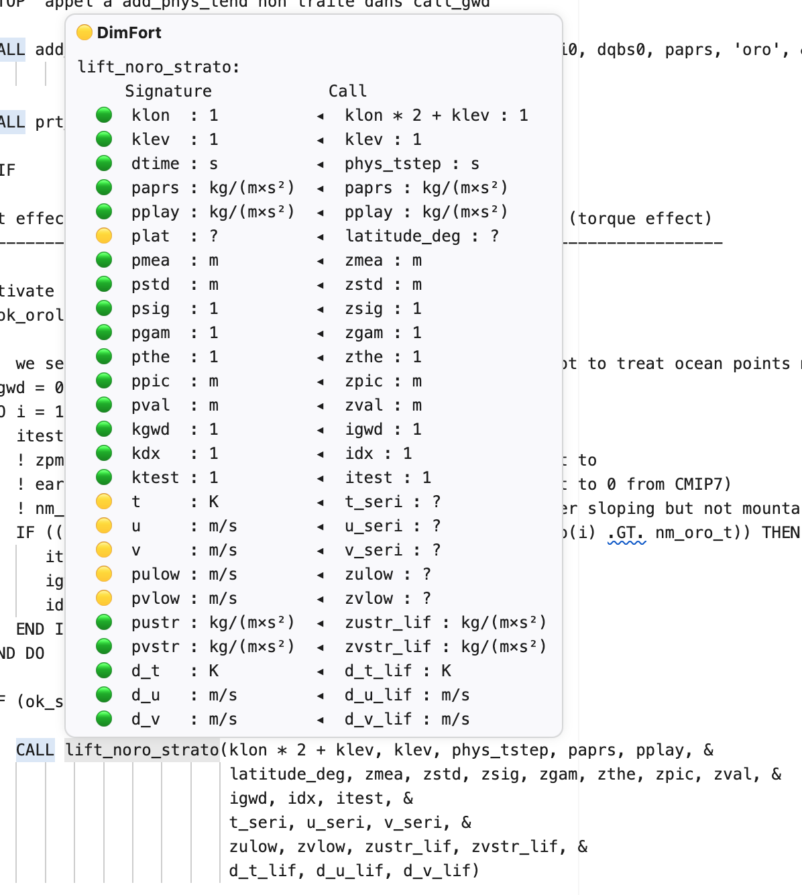
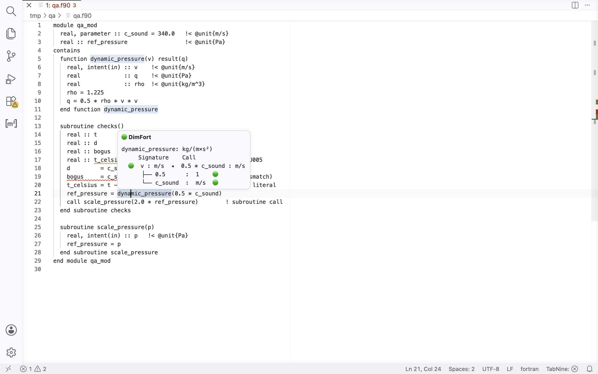
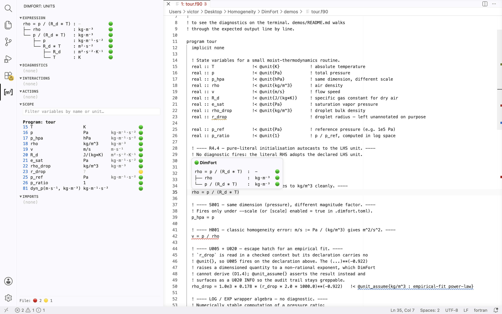
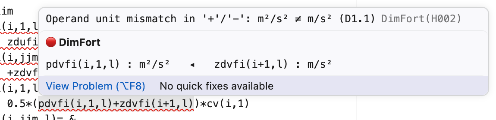
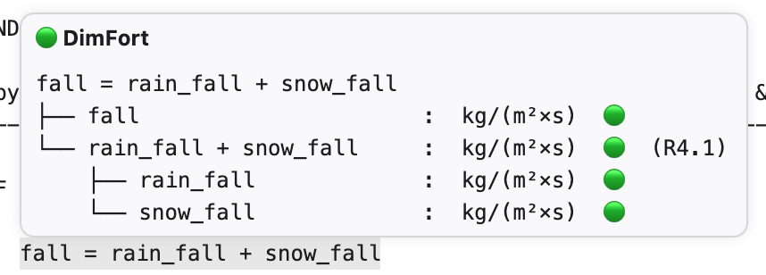
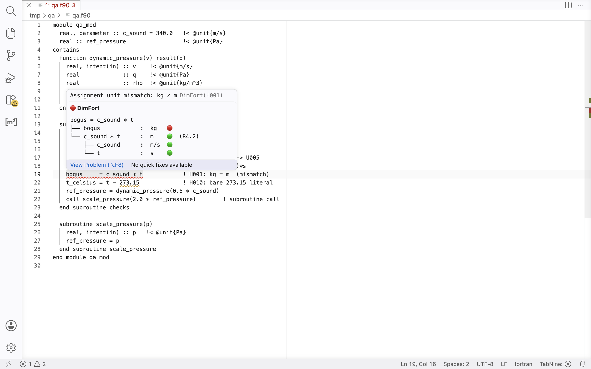

# DimFort hover UI

Specification of the markdown DimFort renders in LSP hovers. Six layouts
total: three *surfaces* (function call, subroutine call, expression),
each with a *Short* and *Detailed* variant chosen per-surface in the
extension settings.

This document covers presentation only — the rules behind the rendered
units live in [unit-algebra.md](unit-algebra.md).


## Notation

| Glyph | Meaning |
|---|---|
| `:` | separates an expression (name / source text) from its unit |
| `→` | in the **pure-signature** hover (cursor on a function/subroutine definition header), separates the formal argument tuple from the return unit, e.g. `(kg·m⁻³, m·s⁻¹) → kg·m⁻¹·s⁻²` |
| `◂` | in assignment / relational hovers, separates a target slot (LHS) from the value flowing into it (RHS) — points from value to target |
| `(expected …)` | trailing annotation on a call-argument row whose actual unit differs from the formal — names the expected unit |
| `🟢` | known and consistent |
| `🟡` | known partially / contains an unannotated leaf |
| `🔴` | known but inconsistent (unit mismatch) |

Header is always `**{marker} DimFort**` followed by a blank line and the
body. The body uses a fenced code block (` ``` `) so monospace
alignment is preserved.

The header marker aggregates the per-row markers in the body:
**🔴** if any row is 🔴, else **🟡** if any row is 🟡, else **🟢**.
Markers are diagnostic-driven and aggregate worst-of-children, so a 🔴
anywhere in a sub-tree propagates up to every ancestor. See
[design/markers.md](design/markers.md) for the derivation.


## Settings and surfaces

A single tri-state setting, **`hover`** (wire key `hover` in
`initializationOptions`), governs every hover:

| Value | Effect |
|---|---|
| `disabled` | No hover at all — the side panel is the unit surface. |
| `short` | One-line summary. |
| `detailed` | Full pairing / unit-algebra tree. |

The verbosity is uniform across all hover surfaces; the *surface* only
determines which layout fires:

| Surface | Triggers when |
|---|---|
| function call | cursor is on the callee identifier of a function call |
| subroutine call | cursor is on the callee identifier of a `call` |
| expression | cursor is inside an assignment, call argument, IF/ELSEIF/WHERE condition, DO loop bound, SELECT CASE selector, or on a bare identifier |

The **side panel is independent**: it always renders detailed and is
governed only by its own open/closed state. The recommended default is
"one cursor-following surface": where the panel is on by default
(Neovim, Emacs) `hover` defaults to `disabled`; where it is off
(VSCode) `hover` defaults to `short`.

Legacy clients that still send `traceHoverEnabled` / the old
per-surface `hover*` keys are mapped onto this enum (any `detailed` or
trace-on → `detailed`, else `short`).


## Conflict resolution

When multiple surfaces would fire at the same cursor position, the
**most-specific node wins**, matching standard LSP behavior:

- Cursor on a bare identifier → identifier hover (even inside an
  assignment or call argument).
- Cursor on the callee identifier of a call → call hover.
- Cursor on whitespace, operators, or punctuation inside an expression
  → the enclosing expression hover.
- Cursor inside a call argument expression but not on the callee →
  expression hover for that argument.


## Layout: function call

Call hovers share the panel's Expression-tree renderer, so the two
surfaces are guaranteed to read identically. The root row is the
**whole call expression as written** (`name(args) : ret`), followed by
one child row per actual argument. The dimensional signature still
appears — on the pure-signature hover for cursor-on-definition (see
below) — it just isn't repeated on call sites.

### Short

<picture>
  <source media="(prefers-color-scheme: dark)" srcset="img/hover-call-short_dark.png">
  
</picture>

```
dynamic_pressure(rho, c_sound * t) : kg·m⁻¹·s⁻²  🔴
├── rho                            : kg·m⁻³      🟢
└── c_sound * t                    : m           🟡  (expected m·s⁻¹)
```

Root row carries the function's return unit and the overall verdict
marker (worst-of: own diagnostics ∨ children). Each child row
shows the actual argument's source text, its resolved unit, a
diagnostic-driven 🟢/🟡/🔴 marker, and — when its unit dimensionally
differs from the formal — an `(expected <formal>)` tail. The
mismatching row paints 🟡 (not 🔴) by the **🟡-on-`expected` override**
documented in [design/markers.md](design/markers.md): the
expression itself resolved cleanly, but its consumer disagrees with
the formal it's flowing into. The 🔴 belongs on the enclosing call,
where H004 fires.


### Detailed

<picture>
  <source media="(prefers-color-scheme: dark)" srcset="img/hover-call-detailed_dark.png">
  
</picture>

Same as Short, plus a sub-tree under any **computed** actual argument
showing how its unit was derived. Bare identifiers and literals do not
expand (the row already shows everything).

```
dynamic_pressure(rho, c_sound * t) : kg·m⁻¹·s⁻²  🔴
├── rho                            : kg·m⁻³      🟢
└── c_sound * t                    : m           🟡  (expected m·s⁻¹)
    ├── c_sound                    : m·s⁻¹       🟢
    └── t                          : s           🟢
```


## Layout: subroutine call

Identical to function call, with one difference: subroutines have no
return unit, so the root row's unit column shows `?` and its
resolution-axis marker paints 🟡 (no consistency diagnostic
disagreement — just no unit to report).

### Short

```
call update_winds(klon, klev, t_local, u_local, dt_out)  :  ?  🟡
├── klon    : 1   🟢
├── klev    : 1   🟢
├── t_local : ?   🟡
├── u_local : ?   🟡
└── dt_out  : K   🟢
```

### Detailed

As above, with sub-trees under any computed actual.


## Layout: pure signature

Cursor on a **function / subroutine definition header** (not a call site)
collapses to just the dimensional-signature line — no per-row table.
Unannotated formal or return slots render as `?`, and the header
marker flips to 🟡 so the line still flags gaps positionally.

```
**🟡 DimFort**

`dynamic_pressure: (kg·m⁻³, ?) → kg·m⁻¹·s⁻²`
```

Rationale: with no call there's no actual argument to compare against,
so a row would only restate the header's units plus a formal param
name — and param names are low-value (physicists' naming conventions
don't reliably say what an arg means). The header alone carries the
full dimensional interface; the "which params lack annotations, by
name" view lives on the module hover.


## Layout: expression

The expression surface covers six cursor positions:

1. Bare identifier
2. Binary operator (`+`, `-`, `*`, `/`, `**`) — local check on its
   parent math expression. `+` / `-` are homogeneity-checked
   (operands must match); `*` / `/` / `**` aren't and report the
   sub-expression's resolved unit.
3. Assignment `=` token, or whitespace inside the assignment
4. Relational expression (`<`, `<=`, `==`, `/=`, `>`, `>=`) — has no
   resulting unit, but its two operands must be homogeneous
5. Computed sub-expression (call arg, IF/ELSEIF/WHERE condition body, DO
   loop bound, SELECT CASE selector)
6. Numeric literal


### Short

**Bare identifier**

```
🟢 DimFort

paprs : kg·m⁻¹·s⁻²
```

Header marker: 🟢 if annotated, 🟡 if unannotated.

**Binary operator** (cursor on `+`, `-`, `*`, `/`, `**`)

For `+` and `-` — one-line homogeneity check on the operator's two
operands (the same shape as the assignment hover, since both rules
require unit equality):

```
🟢 DimFort

a : K   ◂   b : K
```

For `*`, `/`, `**` — there's no homogeneity requirement, so the
hover just reports the resolved unit of the whole sub-expression:

```
🟢 DimFort

a * b : K·m
```

**Assignment** (cursor on `=` or whitespace inside the statement)

<picture>
  <source media="(prefers-color-scheme: dark)" srcset="img/hover-expression-short-assignment_dark.png">
  
</picture>

A homogeneity violation in the same shape — Pa²/s² vs m/s² (real finding
from a reference workspace trial):

<picture>
  <source media="(prefers-color-scheme: dark)" srcset="img/hover-expression-short-mismatch_dark.png">
  
</picture>

```
🟢 DimFort

x : K   ◂   a + b : K
```

One-line homogeneity check. Marker: 🟢 equal, 🔴 mismatch, 🟡 either
side unresolved.

**Initialization autocast (R4.4).** When the entire RHS is a numeric
literal (or unary-minus literal, or arithmetic of literals), it's an
initialization — the literal takes on the LHS's unit and the hover
shows 🟢, e.g. `t : s   ◂   2.0 : s`. No diagnostic fires. This differs
from a literal *inside* a compound expression (`t = c + 2.0`), which
still triggers the D1.5 implicit-cast warning. The assignment marker,
like every marker, is **diagnostic-driven** — read from the file's
diagnostics by range ([design/markers.md](design/markers.md)) — so the
hover and the Problems panel never disagree.

In the detailed-tree view and the side panel, the assignment row shows
**no unit column** (`label  marker`, not `label : unit  marker`) — an
assignment is a statement, not an expression, so it has no unit of its
own; only the homogeneity marker is meaningful.

**Relational expression** (cursor on `<`, `<=`, `==`, `/=`, `>`, `>=`)

```
🟢 DimFort

p : Pa   ◂   0.0 : 1
```

Same homogeneity-check shape as the assignment hover. The relation
itself has no unit; only its two operands' agreement matters. The
checker does **not** currently emit a diagnostic for relational operand
mismatches (it is not an emission site — see
[design/markers.md](design/markers.md) §6.1), so the diagnostic-driven
marker is 🟡 (no consistency diagnostic / no unit), not a re-derived 🔴.
Emitting at relational sites — which would restore a backed 🔴 — is a
documented future enhancement.

**Computed sub-expression**

```
🟢 DimFort

p1 + p2 : kg·m⁻¹·s⁻²
```

Just the resolved unit of the enclosing expression. Marker: 🟢 fully
resolved, 🟡 any leaf unknown.

**Numeric literal**

```
🟢 DimFort

3.0 : 1
```

Numeric literals are dimensionless (`1`). Marker always 🟢.


### Detailed

Cursor on a bare identifier behaves the same as Short — there's nothing
to expand.

For the other three cursor positions, the body is the unit-algebra rule
chain rendered as an ASCII tree. Each row carries a per-node marker in
a right-aligned column so the reader can scan vertically for trouble:

<picture>
  <source media="(prefers-color-scheme: dark)" srcset="img/hover-expression-detailed-clean_dark.png">
  
</picture>

```
🟢 DimFort

x = log(p1) + log(p2)
├── x                  :  LOG(Pa²)   🟢
└── log(p1) + log(p2)  :  LOG(Pa²)   🟢
    ├── log(p1)        :  LOG(Pa)    🟢
    │   └── p1         :  Pa         🟢
    └── log(p2)        :  LOG(Pa)    🟢
        └── p2         :  Pa         🟢
```

A violation example — `+` on two different units propagates 🔴 up the
spine:

<picture>
  <source media="(prefers-color-scheme: dark)" srcset="img/hover-expression-detailed-violation_dark.png">
  
</picture>

```
🔴 DimFort

0.5 * (a + b) * c  :  ?  🔴
├── 0.5            :  1  🟢
├── a + b          :  ?  🔴
│   ├── a          :  m²·s⁻²  🟢
│   └── b          :  m·s⁻²   🟢
└── c              :  ?  🟡
```

Root row is the whole assignment / condition / argument. Each branch is
a sub-expression.

**Call-argument annotation.** When a tree row is a call argument whose
resolved unit dimensionally differs from the callee's formal, the row
gains an `(expected <formal>)` tail — the same annotation the call
hover surfaces. Matching rows carry no extra tail. (Earlier versions
displayed the unit-algebra rule ID on every row; that was debug noise
for the target audience and has been removed.)

**Per-row marker semantics.** Markers are **diagnostic-driven** — a
node's marker is its resolution state worst-of the unit-*consistency*
diagnostics that own it, worst-of its children. So the circle never
disagrees with the squiggle. See [design/markers.md](design/markers.md)
for the model; in short:

- 🟢 — this node resolved to a unit and no consistency diagnostic owns it.
- 🔴 — an **error**-severity consistency diagnostic owns this node (a
  dimension mismatch `H001`/`H002`, or an `S001`/`S002` overridden to
  error), *or* a 🔴 descendant propagated upward (worst-of-children).
- 🟡 — a **warning**-severity consistency diagnostic owns it (`S001`
  scale / `S002` offset at default severity), *or* the node's unit is `?`
  for a non-error reason (unannotated identifier, unsupported intrinsic,
  partial resolution).

Only the consistency family (`H001`–`H004`, `S001`, `S002`) colours a
marker. `H010` implicit-cast smells and `U0xx` annotation-quality codes
keep their squiggles but leave the circle 🟢 (the algebra is consistent).
Sites the checker does not emit for — relational, `max`/`min` — therefore
show 🟡 (no consistency diagnostic), not a re-derived 🔴.


## Examples by cursor position

These ground the rules above with concrete cursor placements.

### `r = log(p1) + log(p2)`

| Cursor on | Surface | Short body | Detailed body |
|---|---|---|---|
| `r` | identifier | `r : LOG(Pa²)` | (same as Short) |
| `=` | assignment | `r : LOG(Pa²)   ◂   log(p1) + log(p2) : LOG(Pa²)` | tree |
| `+` | binary operator | `log(p1) : LOG(Pa)   ◂   log(p2) : LOG(Pa)` (homogeneity check on the operands of `+`) | tree |
| `log` (first) | function call | root row `log(p1) : LOG(Pa)` + one child row per actual (`p1 : Pa 🟢`) | + sub-tree under any computed actual |
| `p1` | identifier | `p1 : Pa` | (same as Short) |
| `(`, `)`, spaces | assignment | (same as on `=`) | tree |


### `if (p > 0.0) then`

| Cursor on | Surface | Short body | Detailed body |
|---|---|---|---|
| `p` | identifier | `p : Pa` | (same as Short) |
| `>` | relational | `p : Pa   ◂   0.0 : 1   🟡` (relational is not an emission site, so no consistency diagnostic → 🟡, not a re-derived 🔴) | tree |
| `0.0` | numeric literal | `0.0 : 1` | (same as Short) |
| `if`, `then`, `(`, `)` | (no hover) | — | — |


### `call update_winds(p1, p2 + 1.0, t_local)`

| Cursor on | Surface | Short body |
|---|---|---|
| `update_winds` | subroutine call | root row `call update_winds(…) : ?` + one child row per actual (see Subroutine call above) |
| `p1` | identifier | `p1 : Pa` |
| `p2` | identifier | `p2 : Pa` |
| `+` | binary operator | `p2 : Pa   ◂   1.0 : 1   🟢` (a bare literal added to Pa is an implicit cast — `H010`/`D1.5`, a *smell* not an inconsistency; it still squiggles but the consistency marker stays 🟢, decision B) |
| `1.0` | numeric literal | `1.0 : 1` |
| `t_local` | identifier | `t_local : ?` (unannotated) |
